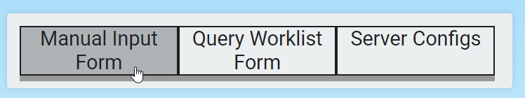
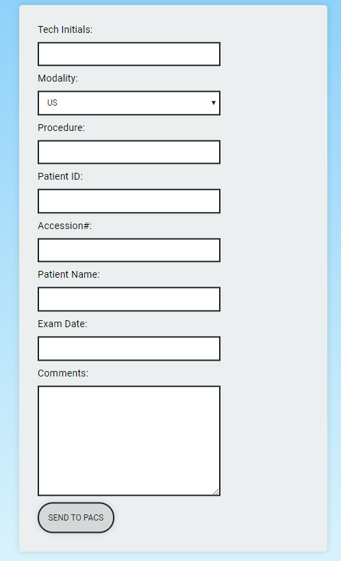
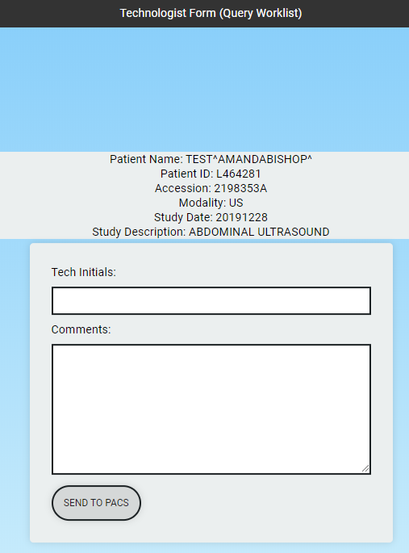
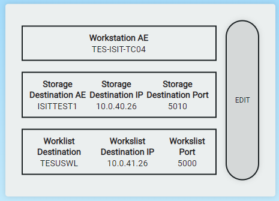
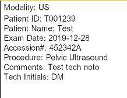

# PACS Forms
[](https://python.org)
[](https://djangoproject.com)

<p align="center">
  
</p>

Application for sending technologist notes as DICOM compliant image to PACS/DICOM Destination via web based form

<details><summary><b>Run this project locally</b></summary>
First, clone the repository to your local machine:

```bash
git clone git@github.com:echoshihab/PACS_Forms.git
```

Install the requirements:

```bash
pip install -r requirements.txt
```

Create the database:

```bash
python manage.py migrate
```

Create the superuser (need it to add initial server configs):
```bash
python manage.py createsuperuser
```

Finally, run the development server:

```bash
python manage.py runserver
```

The project will be available at **127.0.0.1:8000**.

</details>

### Features

* **Manual Input Form**: Send form to destination by manually inputting all required data (e.g. Patient Name, ID etc)


<p align="center">
  
</p>


* **Query Worklist Form**: Prepopulate patient & required data via DICOM modality worklist query and input additional note

<p align="center">
  
</p>


* **Server Configs**: Add & update destination and worklist AE, IP and PORT configs as required

<p align="center">
  
</p>

* **DICOM Compliant**: View sent image via PACS/DICOM Viewer 

<p align="center">
  
</p>

